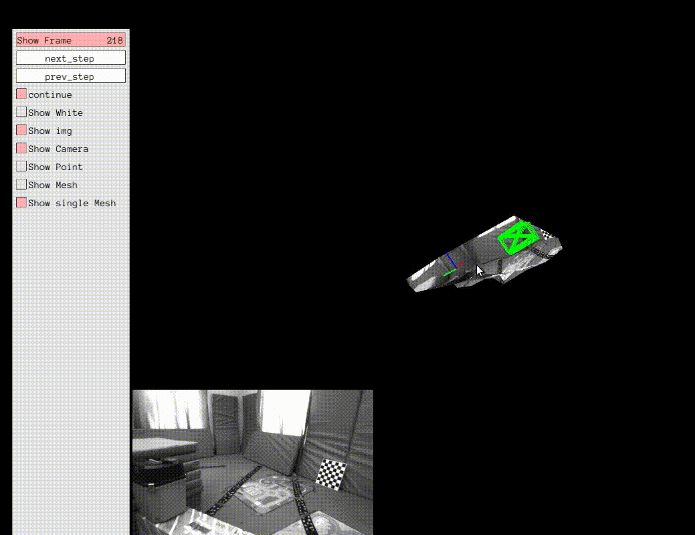

# Co-Planar-Parametrization-VIO

**Related Papers**

* **Leveraging planar regularities for point line visual-inertial odometry**, Xin Li, Yijia He, Jinlong Lin, Xiao Liu, 2020 IEEE/RSJ International Conference on Intelligent Robots and Systems (IROS). IEEE, 2020.
* **Co-Planar Parametrization for Stereo-SLAM and Visual-Inertial Odometry**, Xin Li, Yanyan Li, Evin Pınar Örnek, Jinlong Lin, Federico Tombari, IEEE Robotics and Automation Letters 5.4 (2020): 6972-6979.


> * **Online Temporal Calibration for Monocular Visual-Inertial Systems**, Tong Qin, Shaojie Shen, IEEE/RSJ International Conference on Intelligent Robots and Systems (IROS, 2018), **best student paper award** [pdf](https://ieeexplore.ieee.org/abstract/document/8593603)
>* **VINS-Mono: A Robust and Versatile Monocular Visual-Inertial State Estimator**, Tong Qin, Peiliang Li, Zhenfei Yang, Shaojie Shen, IEEE Transactions on Robotics[pdf](https://ieeexplore.ieee.org/document/8421746/?arnumber=8421746&source=authoralert) 

* *If you use Co-Planar-Parametrization-VIO for your academic research, please cite at least one of our related papers.*





[comment]: <> (* [bib]&#40;https://github.com/HKUST-Aerial-Robotics/VINS-Mono/blob/master/support_files/paper_bib.txt&#41;)


[comment]: <> (# VINS-Mono)

[comment]: <> (## A Robust and Versatile Monocular Visual-Inertial State Estimator)

[comment]: <> (**11 Jan 2019**: An extension of **VINS**, which supports stereo cameras / stereo cameras + IMU / mono camera + IMU, is published at [VINS-Fusion]&#40;https://github.com/HKUST-Aerial-Robotics/VINS-Fusion&#41;)

[comment]: <> (**29 Dec 2017**: New features: Add map merge, pose graph reuse, online temporal calibration function, and support rolling shutter camera. Map reuse videos: )

[comment]: <> (<a href="https://www.youtube.com/embed/WDpH80nfZes" target="_blank"> (alt="cla" width="240" height="180" border="10" /></a>)

[comment]: <> (<a href="https://www.youtube.com/embed/eINyJHB34uU" target="_blank"> (alt="icra" width="240" height="180" border="10" /></a>)

[comment]: <> (VINS-Mono is a real-time SLAM framework for **Monocular Visual-Inertial Systems**. It uses an optimization-based sliding window formulation for providing high-accuracy visual-inertial odometry. It features efficient IMU pre-integration with bias correction, automatic estimator initialization, online extrinsic calibration, failure detection and recovery, loop detection, and global pose graph optimization, map merge, pose graph reuse, online temporal calibration, rolling shutter support. VINS-Mono is primarily designed for state estimation and feedback control of autonomous drones, but it is also capable of providing accurate localization for AR applications. This code runs on **Linux**, and is fully integrated with **ROS**. For **iOS** mobile implementation, please go to [VINS-Mobile]&#40;https://github.com/HKUST-Aerial-Robotics/VINS-Mobile&#41;.)

[comment]: <> (**Authors:** [Tong Qin]&#40;http://www.qintonguav.com&#41;, [Peiliang Li]&#40;https://github.com/PeiliangLi&#41;, [Zhenfei Yang]&#40;https://github.com/dvorak0&#41;, and [Shaojie Shen]&#40;http://www.ece.ust.hk/ece.php/profile/facultydetail/eeshaojie&#41; from the [HUKST Aerial Robotics Group]&#40;http://uav.ust.hk/&#41;)

[comment]: <> (**Videos:**)

[comment]: <> (<a href="https://www.youtube.com/embed/mv_9snb_bKs" target="_blank"> (alt="euroc" width="240" height="180" border="10" /></a>)

[comment]: <> (<a href="https://www.youtube.com/embed/g_wN0Nt0VAU" target="_blank"> (alt="indoor_outdoor" width="240" height="180" border="10" /></a>)

[comment]: <> (<a href="https://www.youtube.com/embed/I4txdvGhT6I" target="_blank"> (alt="AR_demo" width="240" height="180" border="10" /></a>)

[comment]: <> (EuRoC dataset;                  Indoor and outdoor performance;                         AR application;)

[comment]: <> (<a href="https://www.youtube.com/embed/2zE84HqT0es" target="_blank"> (alt="MAV platform" width="240" height="180" border="10" /></a>)

[comment]: <> (<a href="https://www.youtube.com/embed/CI01qbPWlYY" target="_blank"> (alt="Mobile platform" width="240" height="180" border="10" /></a>)

[comment]: <> ( MAV application;               Mobile implementation &#40;Video link for mainland China friends: [Video1]&#40;http://www.bilibili.com/video/av10813254/&#41; [Video2]&#40;http://www.bilibili.com/video/av10813205/&#41; [Video3]&#40;http://www.bilibili.com/video/av10813089/&#41; [Video4]&#40;http://www.bilibili.com/video/av10813325/&#41; [Video5]&#40;http://www.bilibili.com/video/av10813030/&#41;&#41;)

[comment]: <> (**Related Papers**)

[comment]: <> (* **Online Temporal Calibration for Monocular Visual-Inertial Systems**, Tong Qin, Shaojie Shen, IEEE/RSJ International Conference on Intelligent Robots and Systems &#40;IROS, 2018&#41;, **best student paper award** [pdf]&#40;https://ieeexplore.ieee.org/abstract/document/8593603&#41;)

[comment]: <> (* **VINS-Mono: A Robust and Versatile Monocular Visual-Inertial State Estimator**, Tong Qin, Peiliang Li, Zhenfei Yang, Shaojie Shen, IEEE Transactions on Robotics[pdf]&#40;https://ieeexplore.ieee.org/document/8421746/?arnumber=8421746&source=authoralert&#41; )

[comment]: <> (*If you use VINS-Mono for your academic research, please cite at least one of our related papers.*[bib]&#40;https://github.com/HKUST-Aerial-Robotics/VINS-Mono/blob/master/support_files/paper_bib.txt&#41;)

[comment]: <> (## 1. Prerequisites)

[comment]: <> (1.1 **Ubuntu** and **ROS**)

[comment]: <> (Ubuntu  16.04.)

[comment]: <> (ROS Kinetic. [ROS Installation]&#40;http://wiki.ros.org/ROS/Installation&#41;)

[comment]: <> (additional ROS pacakge)

[comment]: <> (```)

[comment]: <> (    sudo apt-get install ros-YOUR_DISTRO-cv-bridge ros-YOUR_DISTRO-tf ros-YOUR_DISTRO-message-filters ros-YOUR_DISTRO-image-transport)

[comment]: <> (```)


[comment]: <> (1.2. **Ceres Solver**)

[comment]: <> (Follow [Ceres Installation]&#40;http://ceres-solver.org/installation.html&#41;, remember to **make install**.)

[comment]: <> (&#40;Our testing environment: Ubuntu 16.04, ROS Kinetic, OpenCV 3.3.1, Eigen 3.3.3&#41; )

[comment]: <> (## 2. Build VINS-Mono on ROS)

[comment]: <> (Clone the repository and catkin_make:)

[comment]: <> (```)

[comment]: <> (    cd ~/catkin_ws/src)

[comment]: <> (    git clone https://github.com/HKUST-Aerial-Robotics/VINS-Mono.git)

[comment]: <> (    cd ../)

[comment]: <> (    catkin_make)

[comment]: <> (    source ~/catkin_ws/devel/setup.bash)

[comment]: <> (```)

[comment]: <> (## 3. Visual-Inertial Odometry and Pose Graph Reuse on Public datasets)

[comment]: <> (Download [EuRoC MAV Dataset]&#40;http://projects.asl.ethz.ch/datasets/doku.php?id=kmavvisualinertialdatasets&#41;. Although it contains stereo cameras, we only use one camera. The system also works with [ETH-asl cla dataset]&#40;http://robotics.ethz.ch/~asl-datasets/maplab/multi_session_mapping_CLA/bags/&#41;. We take EuRoC as the example.)

[comment]: <> (**3.1 visual-inertial odometry and loop closure**)

[comment]: <> (3.1.1 Open three terminals, launch the vins_estimator , rviz and play the bag file respectively. Take MH_01 for example)

[comment]: <> (```)

[comment]: <> (    roslaunch vins_estimator euroc.launch )

[comment]: <> (    roslaunch vins_estimator vins_rviz.launch)

[comment]: <> (    rosbag play YOUR_PATH_TO_DATASET/MH_01_easy.bag )

[comment]: <> (```)

[comment]: <> (&#40;If you fail to open vins_rviz.launch, just open an empty rviz, then load the config file: file -> Open Config-> YOUR_VINS_FOLDER/config/vins_rviz_config.rviz&#41;)

[comment]: <> (3.1.2 &#40;Optional&#41; Visualize ground truth. We write a naive benchmark publisher to help you visualize the ground truth. It uses a naive strategy to align VINS with ground truth. Just for visualization. not for quantitative comparison on academic publications.)

[comment]: <> (```)

[comment]: <> (    roslaunch benchmark_publisher publish.launch  sequence_name:=MH_05_difficult)

[comment]: <> (```)

[comment]: <> ( &#40;Green line is VINS result, red line is ground truth&#41;. )
 
[comment]: <> (3.1.3 &#40;Optional&#41; You can even run EuRoC **without extrinsic parameters** between camera and IMU. We will calibrate them online. Replace the first command with:)

[comment]: <> (```)

[comment]: <> (    roslaunch vins_estimator euroc_no_extrinsic_param.launch)

[comment]: <> (```)

[comment]: <> (**No extrinsic parameters** in that config file.  Waiting a few seconds for initial calibration. Sometimes you cannot feel any difference as the calibration is done quickly.)

[comment]: <> (**3.2 map merge**)

[comment]: <> (After playing MH_01 bag, you can continue playing MH_02 bag, MH_03 bag ... The system will merge them according to the loop closure.)

[comment]: <> (**3.3 map reuse**)

[comment]: <> (3.3.1 map save)

[comment]: <> (Set the **pose_graph_save_path** in the config file &#40;YOUR_VINS_FOLEDER/config/euroc/euroc_config.yaml&#41;. After playing MH_01 bag, input **s** in vins_estimator terminal, then **enter**. The current pose graph will be saved. )

[comment]: <> (3.3.2 map load)

[comment]: <> (Set the **load_previous_pose_graph** to 1 before doing 3.1.1. The system will load previous pose graph from **pose_graph_save_path**. Then you can play MH_02 bag. New sequence will be aligned to the previous pose graph.)

[comment]: <> (## 4. AR Demo)

[comment]: <> (4.1 Download the [bag file]&#40;https://www.dropbox.com/s/s29oygyhwmllw9k/ar_box.bag?dl=0&#41;, which is collected from HKUST Robotic Institute. For friends in mainland China, download from [bag file]&#40;https://pan.baidu.com/s/1geEyHNl&#41;.)

[comment]: <> (4.2 Open three terminals, launch the ar_demo, rviz and play the bag file respectively.)

[comment]: <> (```)

[comment]: <> (    roslaunch ar_demo 3dm_bag.launch)

[comment]: <> (    roslaunch ar_demo ar_rviz.launch)

[comment]: <> (    rosbag play YOUR_PATH_TO_DATASET/ar_box.bag )

[comment]: <> (```)

[comment]: <> (We put one 0.8m x 0.8m x 0.8m virtual box in front of your view. )

[comment]: <> (## 5. Run with your device )

[comment]: <> (Suppose you are familiar with ROS and you can get a camera and an IMU with raw metric measurements in ROS topic, you can follow these steps to set up your device. For beginners, we highly recommend you to first try out [VINS-Mobile]&#40;https://github.com/HKUST-Aerial-Robotics/VINS-Mobile&#41; if you have iOS devices since you don't need to set up anything.)

[comment]: <> (5.1 Change to your topic name in the config file. The image should exceed 20Hz and IMU should exceed 100Hz. Both image and IMU should have the accurate time stamp. IMU should contain absolute acceleration values including gravity.)

[comment]: <> (5.2 Camera calibration:)

[comment]: <> (We support the [pinhole model]&#40;http://docs.opencv.org/2.4.8/modules/calib3d/doc/camera_calibration_and_3d_reconstruction.html&#41; and the [MEI model]&#40;http://www.robots.ox.ac.uk/~cmei/articles/single_viewpoint_calib_mei_07.pdf&#41;. You can calibrate your camera with any tools you like. Just write the parameters in the config file in the right format. If you use rolling shutter camera, please carefully calibrate your camera, making sure the reprojection error is less than 0.5 pixel.)

[comment]: <> (5.3 **Camera-Imu extrinsic parameters**:)

[comment]: <> (If you have seen the config files for EuRoC and AR demos, you can find that we can estimate and refine them online. If you familiar with transformation, you can figure out the rotation and position by your eyes or via hand measurements. Then write these values into config as the initial guess. Our estimator will refine extrinsic parameters online. If you don't know anything about the camera-IMU transformation, just ignore the extrinsic parameters and set the **estimate_extrinsic** to **2**, and rotate your device set at the beginning for a few seconds. When the system works successfully, we will save the calibration result. you can use these result as initial values for next time. An example of how to set the extrinsic parameters is in[extrinsic_parameter_example]&#40;https://github.com/HKUST-Aerial-Robotics/VINS-Mono/blob/master/config/extrinsic_parameter_example.pdf&#41;)

[comment]: <> (5.4 **Temporal calibration**:)

[comment]: <> (Most self-made visual-inertial sensor sets are unsynchronized. You can set **estimate_td** to 1 to online estimate the time offset between your camera and IMU.  )

[comment]: <> (5.5 **Rolling shutter**:)

[comment]: <> (For rolling shutter camera &#40;carefully calibrated, reprojection error under 0.5 pixel&#41;, set **rolling_shutter** to 1. Also, you should set rolling shutter readout time **rolling_shutter_tr**, which is from sensor datasheet&#40;usually 0-0.05s, not exposure time&#41;. Don't try web camera, the web camera is so awful.)

[comment]: <> (5.6 Other parameter settings: Details are included in the config file.)

[comment]: <> (5.7 Performance on different devices: )

[comment]: <> (&#40;global shutter camera + synchronized high-end IMU, e.g. VI-Sensor&#41; > &#40;global shutter camera + synchronized low-end IMU&#41; > &#40;global camera + unsync high frequency IMU&#41; > &#40;global camera + unsync low frequency IMU&#41; > &#40;rolling camera + unsync low frequency IMU&#41;. )

[comment]: <> (## 6. Docker Support)

[comment]: <> (To further facilitate the building process, we add docker in our code. Docker environment is like a sandbox, thus makes our code environment-independent. To run with docker, first make sure [ros]&#40;http://wiki.ros.org/ROS/Installation&#41; and [docker]&#40;https://docs.docker.com/install/linux/docker-ce/ubuntu/&#41; are installed on your machine. Then add your account to `docker` group by `sudo usermod -aG docker $YOUR_USER_NAME`. **Relaunch the terminal or logout and re-login if you get `Permission denied` error**, type:)

[comment]: <> (```)

[comment]: <> (cd ~/catkin_ws/src/VINS-Mono/docker)

[comment]: <> (make build)

[comment]: <> (./run.sh LAUNCH_FILE_NAME   # ./run.sh euroc.launch)

[comment]: <> (```)

[comment]: <> (Note that the docker building process may take a while depends on your network and machine. After VINS-Mono successfully started, open another terminal and play your bag file, then you should be able to see the result. If you need modify the code, simply run `./run.sh LAUNCH_FILE_NAME` after your changes.)


[comment]: <> (## 7. Acknowledgements)

[comment]: <> (We use [ceres solver]&#40;http://ceres-solver.org/&#41; for non-linear optimization and [DBoW2]&#40;https://github.com/dorian3d/DBoW2&#41; for loop detection, and a generic [camera model]&#40;https://github.com/hengli/camodocal&#41;.)

[comment]: <> (## 8. Licence)

[comment]: <> (The source code is released under [GPLv3]&#40;http://www.gnu.org/licenses/&#41; license.)

[comment]: <> (We are still working on improving the code reliability. For any technical issues, please contact Tong QIN <tong.qinATconnect.ust.hk> or Peiliang LI <pliapATconnect.ust.hk>.)

[comment]: <> (For commercial inquiries, please contact Shaojie SHEN <eeshaojieATust.hk>)
